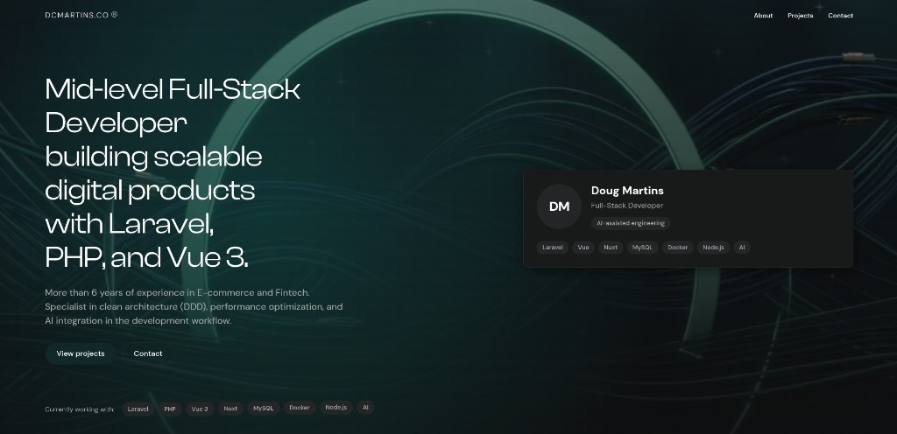

# Doug Martins

Landing page em Nuxt 3. A aplicação está na raiz do repositório: uma página, a hero de portfolio, e arranque por Docker.

## Página

A home (`pages/index.vue`) monta, por esta ordem:

1. **Header** — Projects (GitHub), Contact (mailto) e LinkedIn.
2. **Hero** — título, cartão e trust bar.

## Estrutura

```text
app.vue                 shell da aplicação
pages/index.vue         página única
components/             secções da landing
assets/css/             estilos
public/                 favicon e robots.txt
nuxt.config.ts          head, SEO e Nitro
Dockerfile
docker-compose.yml
docker/entrypoint.sh
Makefile
.env.example
```

Não há pasta `frontend/` nem API. O domínio de negócio ainda não existe no backend, por isso o frontend não abre pastas de contexto.

## Arranque

```bash
make up
```

O site fica em `http://localhost:3000`. O contentor corre `npm install` e `npm run dev -- --host 0.0.0.0 --port 3000`.

| Alvo | Efeito |
| --- | --- |
| `make up` | sobe e constrói o serviço `frontend` |
| `make logs` | acompanha os logs |
| `make shell` | shell dentro do contentor |
| `make down` | pára os contentores |

## SEO

Título, descrição, URL canónico, Open Graph e o JSON-LD usam `NUXT_PUBLIC_SITE_URL`.

Em local o valor é `http://localhost:3000` (ver `.env.example`). Em produção, defina o domínio público antes do `make up`.

## Autor

Douglas C Martins. [GitHub](https://github.com/dougCmartins).


